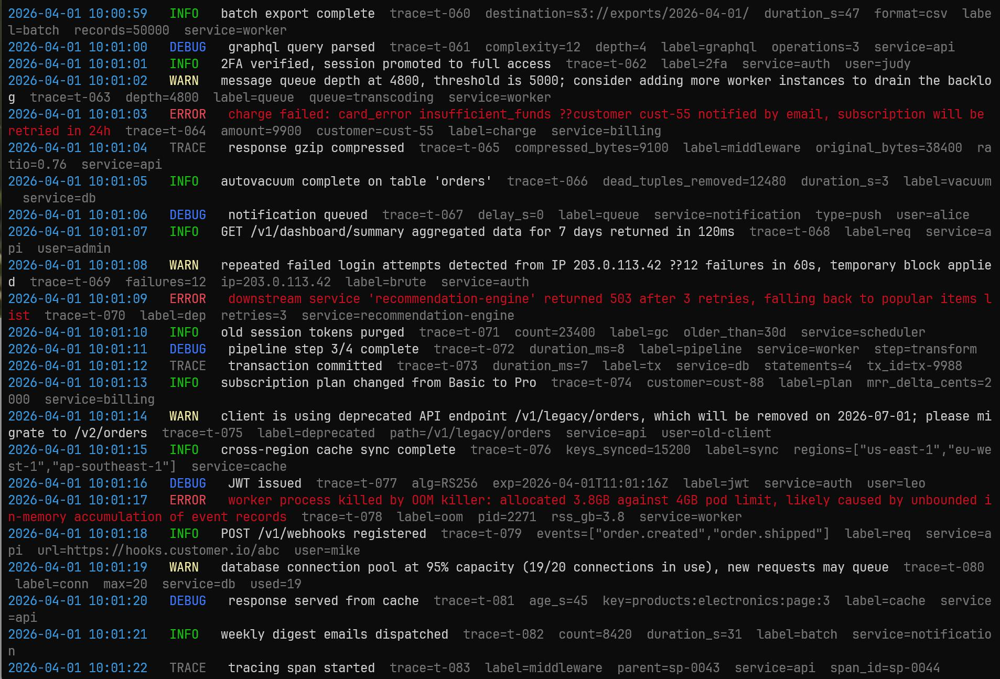
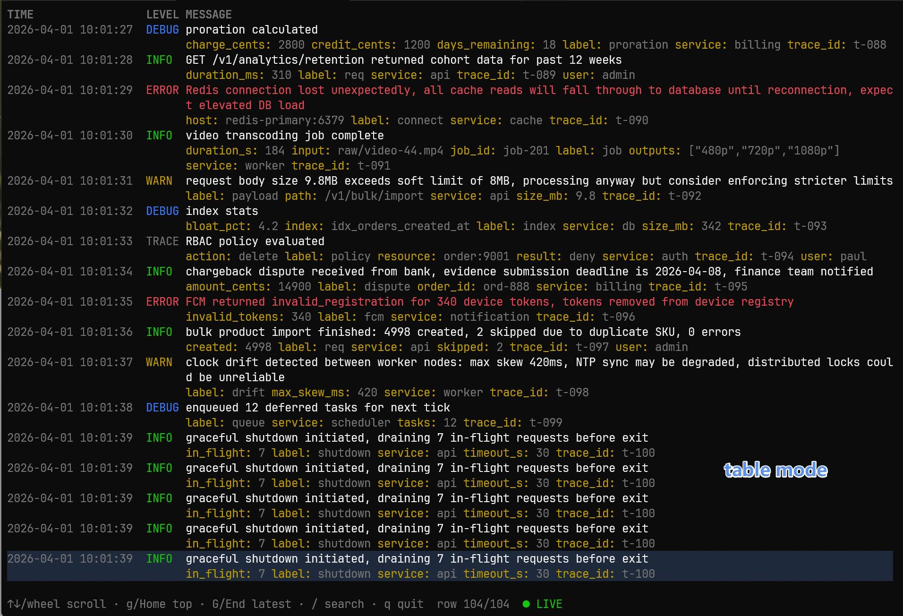

# pretty-log

Pipe your JSON logs in, get colored human-readable output back. Works with `tail -f` for live streams, or `-t` for a full-terminal table view.

**[中文版本](README.zh-CN.md)** | **[English](README.md)**

[](https://www.rust-lang.org/)
[](LICENSE)

## Features

- Streaming JSON parsing — reads line by line, no buffering delay
- ANSI colors — auto-detected from the terminal, colorized by log level
- Multi-line support — stack traces group with their parent log entry
- Zero config needed — common field names work out of the box (`level`, `time`, `msg`, `trace_id`)
- Interactive table mode with search, scrolling, and a detail panel
- YAML config for remapping field names if your logs use different keys
- Single static binary, ~5 MB, no runtime dependencies

## Install

### Homebrew (macOS and Linux)

```bash
brew install jsooo/tap/pretty-log
```

See [HOMEBREW.md](HOMEBREW.md) for more details.

### From source

```bash
git clone https://github.com/jsooo/pretty-log.git
cd pretty-log
cargo build --release
./target/release/pretty --help
```

## Usage

```bash
tail -f app.log | pretty              # live stream with colors
cat app.log | pretty                  # pipe a file
tail -f app.log | pretty -t           # interactive table mode
cat app.log | pretty --no-color | grep ERROR   # pipe-friendly output
```

## What does it look like?

Input:

```json
{"level":"info","msg":"server started","port":8080,"time":"2024-06-15T14:30:00Z"}
{"level":"error","msg":"crash","trace_id":"abc-123","time":"2024-06-15T14:30:01Z"}
goroutine 1 [running]:
main.handler(...)
```

Output:

```
14:30:00  INFO   server started  port=8080
14:30:01  ERROR  crash  trace=abc-123
  goroutine 1 [running]:
  main.handler(...)
```



## Options

| Flag | Description |
|------|-------------|
| `-s`, `--expand` | Expand nested JSON field values |
| `-e`, `--highlight-errors` | Highlight error keywords in message |
| `-t`, `--table` | Enable interactive table view |
| `--config <path>` | Path to config file |
| `--no-color` | Disable ANSI color output |

## Table Mode

Run with `-t`. Logs fill the terminal in a scrollable table — long messages wrap, a detail panel shows the full entry, and search works on everything.

Key bindings:

| Key | Action |
|-----|--------|
| `↑` / `↓` | Move cursor up / down |
| Mouse wheel | Scroll |
| `g` / `Home` | Jump to first row |
| `G` / `End` | Jump to latest row |
| `Space` | Pause / resume live tail |
| `/` | Open search |
| `n` / `N` | Next / previous search match |
| `Esc` | Clear search |
| `q` | Quit |

Search uses KMP for fast case-insensitive matching across message and all fields, with matches highlighted inline.

Scroll up during a live stream and new logs keep buffering in the background. The status bar shows `↓ N new` — press `G` or `End` to catch up.



## Configuration

Config file locations (in priority order):

1. `--config <path>`
2. `.pretty.yaml` in current directory
3. `~/.config/pretty/config.yaml`

```yaml
fields:
  level:     [level, lvl, severity, log_level]
  timestamp: [time, timestamp, ts, "@timestamp"]
  message:   [msg, message, body]
  trace_id:  [trace_id, traceId, request_id, x-trace-id]
  caller:    [caller, file, source]

expand_nested: false
highlight_errors: false

multiline:
  enabled: true
  continuation_pattern: "^[^{]"

table:
  columns: [time, level, message]
```

## Default field names

Recognized out of the box:

- **level** — `level`, `lvl`, `severity`, `log_level`
- **timestamp** — `time`, `timestamp`, `ts`, `@timestamp`
- **message** — `msg`, `message`, `body`
- **trace_id** — `trace_id`, `traceId`, `traceid`, `request_id`, `x-trace-id`
- **caller** — `caller`, `file`, `source`

## Colors

| Level | Color |
|-------|-------|
| ERROR | Red |
| WARN  | Yellow |
| INFO  | Green |
| DEBUG | Blue |
| TRACE | Dark gray |

## How it works

```
stdin
  └─ reader thread (blocking read_line)
       └─ channel (50ms timeout flush)
            └─ multiline assembler
                 └─ parser → classifier → renderer → stdout
```

The 50ms timeout ensures the last line of each burst is flushed promptly — that's what makes `tail -f` work without lag.

## Project structure

```
pretty-log/
├── src/
│   ├── main.rs          entry point, CLI flags, streaming loop
│   ├── config.rs        load and merge YAML config
│   ├── reader.rs        multiline grouping, continuation checker
│   ├── parser.rs        detect JSON, extract fields
│   ├── classifier.rs    map fields to semantic roles
│   ├── renderer.rs      format and colorize output
│   └── table.rs         interactive TUI table mode (-t)
├── tests/
│   └── integration.rs   end-to-end pipeline tests
├── Cargo.toml
└── README.md
```

## Build and test

```bash
cargo build
cargo build --release
cargo test
```

## Known limits

- JSON objects only — top-level arrays pass through as raw text
- No built-in filtering — pipe to `grep` or `jq`
- Invalid regex in config falls back to the default pattern

## License

GPL-3.0

---

Made with ❤️ in Rust
